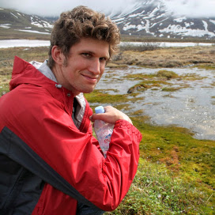
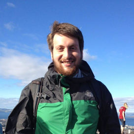

# President: Keith Hughitt (UMD)

{: .organizer-image .float-left }

> Graduate researcher at the University of Maryland, College Park, working in
> the lab of [Najib El-Sayed](http://www.najibelsayed.org/research.aspx).
> Research interests include co-expression and network analysis of
> dual-species transcriptomics datasets, network parameter optimization,
> and gene regulatory element prediction. Passionate about open and
> reproducible research methods and efficient software engineering approaches
> for the sciences.

# Vice President: Mahfuza Sharmin (UMD)

# Secretary: Eli Draizen (NIH)

{: .organizer-image .float-left }

> PhD Student from the Bay Area, working in the labs of Phil Bourne (NCBI/UVA)
> and Mike Grigg (NIAID) through the BU-NIH GPP. Eli is interested in the
> structural and evolutionary view of pathogen invasion in Apicomplexan
> parasites (e.g. Malaria and Toxoplasmosis). When he is not doing science, you
> can find him rock climbing or playing drums with his band Dothraki Deception.

# Institutional Representative: Jonathan Goodson (UMD)

# Institutional Representative: Michael Chambers (NIH)

{: .organizer-image .float-left }

> Born and raised in northwest Ohio, followed love out to D.C., and fell into
> vaccine research with the National Institutes of Health. My scientific
> interests revolve around immunology and de novo protein design, I'm currently
> examining human responses to sub-dominate hemaglutinin subtypes to inform the
> design of a universal influenza vaccine. I also enjoy backpacking, ceramics,
> and pancakes.

