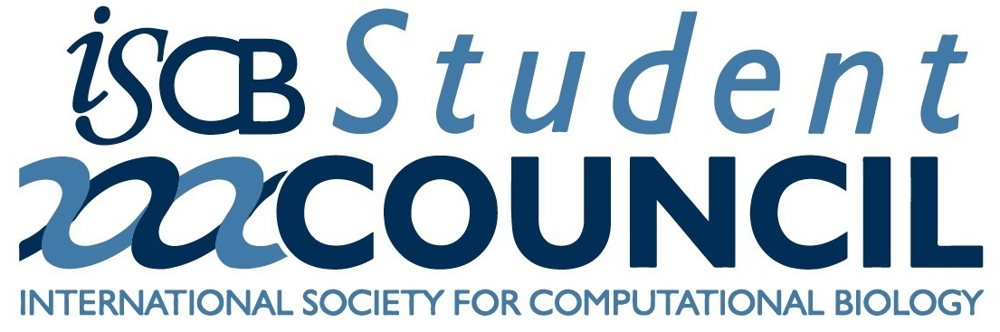

Welcome to the homepage for the [ISCB](http://www.iscb.org/) Washington DC
metropolitan area regional student group ([RSG](http://rsg.iscbsc.org/)) 2017
summer workshop!

On July 12, 2017, we will be hosting a free one-day workshop series with
hands-on / open-laptop tutorials focused on various topics in bioinformatics,
computational biology and genomics. The workshop is student-driven, with
primarily graduate students and post-docs leading the various discussions, but
is open to anyone interested: students, post-docs, faculty, staff scientists,
etc.

# Schedule

NOTE: The following schedule is incomplete and is
likely to change in the coming weeks.

Workshop talks have been divided into three sessions throughout the day:
Morning I, Morning II, and Afternoon I. During each session, participants can
choose from one of two talks to attend.

The workshops will take place in one of two locations: BRB 1412 (Session A) and
PHY 1204 (Session B).

<table id='schedule-table'>
  <thead>
    <tr>
      <th>Times</th>
      <th>Session A</th>
      <th>Session B</th>
    </tr>
  </thead>
  <tbody>
    <tr>
      <td>08:40 - 09:00</td>
      <td colspan="2" align="center" valign="center">
      <strong>Welcome and Introductions</strong></td>
    </tr>
    <tr>
      <td>09:00 - 10:00</td>
      <td colspan="2" align="center" valign="center">
       
       
      <strong>Keynote Speaker (<a href="https://neuroscience.nih.gov/forrest/Home.aspx">Lucy Forrest</a></strong>: Connecting the alternating access hypothesis of transmembrane transport to structural asymmetry using modeling and theory)
      </td>
    </tr>
    <tr>
      <td>10:00 - 10:30</td>
      <td colspan="2" align="center"><strong>Coffee Break</strong></td>
    </tr>
    <tr>
      <td>10:30 - 11:30</td>
      <td>TBA (Jamie Iranzo Sanz, NIH)</td>
      <td>Metagenomic taxon identification: challenges and future directions (Nidhi Shah, UMD)</td>
    </tr>
    <tr>
      <td>11:30 - 12:30</td>
      <td>Networks inside Human Cells: Using Bioinformatics Towards Unraveling Cancer (Yasaswini Iyer, Briar Woods High School)</td>
      <td>Using Genetics to Unravel Cryptic Genetic Recombination and the Clonal Theory in Toxoplasma (Andrea Kennard, JHU)</td>
    </tr>
    <tr>
      <td>12:30 - 2:30</td>
      <td colspan="2" align="center">
        <strong>Lunch with Leaders from Academia and Industry</strong> 
        <ul style='columns: 1; -webkit-columns: 1; -moz-columns: 1; list-style: none;'>
            <li>Ben Busby (NIH) [Topic: TBA]</li>
            <li>Liliana D. Florea (JHU) [A scientific career in the academia vs. high-tech/bio-tech]</li>
            <li>Lucy Forest (NIH) [Building successful collaborations bridging computation and experiment]</li>
            <li>Eytan Rupin (UMD) [How to lead a successful career]</li>
            <li>Andrey Tovchigrechko (MedImmune) [Reproducible research in bioinformatics and computational biology]</li>
        </ul>
      </td>
    </tr>
    <tr>
      <td>2:30 - 3:30</td>
      <td>Applications of Multiple Instance Learning (MIL) and Hashing in Phenotype Prediction from Metagenome Sequences (Mohammad Rahman, GMU)</td>
      <td>TBD (Justin Wagner, UMD)</td>
    </tr>
    <tr>
      <td>3:30 - 4:30</td>
      <td colspan="2" align="center"><strong>Industry Speaker: Andrey Tovchigrechko (MedImmune)</strong> </td>
    </tr>
    <tr>
      <td>4:30 - 5:00</td>
      <td colspan="2" align="center"><strong>Closing Remarks</strong></td>
    </tr>
  </tbody>
</table>

# Registration
 * Deadline: TBD
 * URL: TBA

Registration is FREE, but it is required in order for us to determine how many
people to accommodate for lunch. If you are not able to register by the date
above, you are still welcome to come to the workshop and we will do our best to
accommodate all attendees, but we cannot guarantee meals for all who do not
register.

# Lunch

Lunch will be provided for all registered attendees. Vegetarian and vegan
options will be provided. If you have other special dietary needs, please
contact one of the organizers and we will make sure that there is something
suitable provided.

# Venue

The workshop will take place in the John S. Toll Physics buildings (PHY) at the
University of Maryland, College Park campus. Registration will start at 8:30am
in the physics building, just outside of PHY 1412. Introduction, short research
talks, and closing remarks will all take place in this location. The workshop
sessions will take place in one of two rooms located in the same building (PHY
1412/PHY 1204). See the schedule section for details.

**PHY 1412**
**John S. Toll Physics Bldg, College Park, MD 20740**

<iframe src="https://www.google.com/maps/embed?pb=!1m18!1m12!1m3!1d1096.4249912002817!2d-76.94100036343907!3d38.98888599853324!2m3!1f0!2f0!3f0!3m2!1i1024!2i768!4f13.1!3m3!1m2!1s0x89b7c6a2b3f9d929%3A0x36688149862d4620!2sDepartment+of+Physics!5e0!3m2!1sen!2sus!4v1494852613808" width="600" height="450" frameborder="0" style="border:0" allowfullscreen></iframe>

Volunteer organizers will be on-hand to help direct you to each of the relevant meeting locations.

# Metro

There is a [free shuttle bus service](http://www.dots.umd.edu/schedules.html)
that runs between the [College Park
metro](http://www.wmata.com/rail/station_detail.cfm?station_id=79) stop on the
green line and the University of Maryland campus:

* Exit from the metro station, and follow the tunnel which leads under the train tracks in the rear.
* Take the stairs up and look for signs for the **104 Shuttle** immediately to your right.
* Take the bus to the Regents Parking Garage stop (the terminal stop for the bus line).
* The Physics building is located across the street, just to the right of (and connected with) the Chemistry building.

# Driving

<!-- TODO: Add nearest parking location -->

There are metered parking spaces throughout the campus. See the [UMD DOTS
website](http://www.transportation.umd.edu/maps&apps.html) for more information
on parking locations and rates.

Due to construction planned for the summer, the Regent Parking garage that was
suggested for last year's workshop will be unavailable.

The two recommended visitor parking lots are:

- [Union Lane Garage](https://www.admissions.umd.edu/visit/unionlanegarage.php) 
- [XFINITY Visitor Lot (9c)](http://www.transportation.umd.edu/parking/maps/map_color.pdf)

Each lot is about a 10 minute walk from the workshop venue.

# Contact

If you have any questions about the meeting, you can contact one of the meeting [organizers](https://iscb-dc-rsg.github.io/organizers/).

# Flyer

  TBA

# Sponsors

| [{:height="270px" width="250px"}](http://www.cbcb.umd.edu)  | [{:height="250px" width="250px"}](http://www.bisi.umd.edu) | [{:height="280px" width="250px"}](https://www.iscb.org) |

